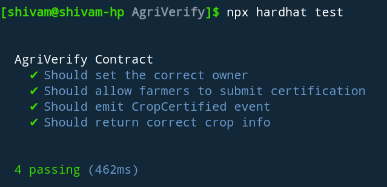
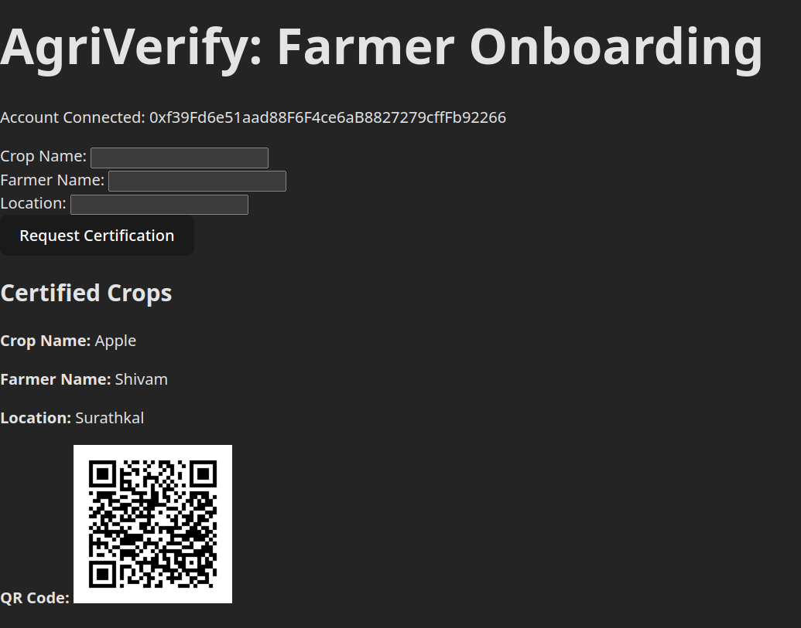

THIS IS THE DEVELOPMENT ENVIRONMENT

use to create a CONTRACT'S ABI file
```shell
npx hardhat help
npx hardhat test
npx hardhat node
npx hardhat ignition deploy ./ignition/modules/Lock.js
```


Date: 5/10/24
