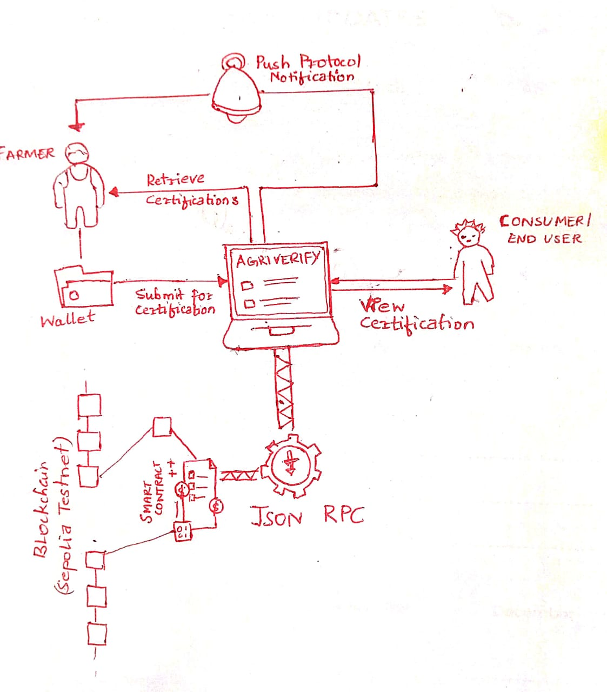

# AgriVerify Documentation

**AgriVerify** is a decentralized platform that allows farmers to certify their organic produce using blockchain technology. It ensures trust and transparency in the certification of organic crops, providing consumers the ability to verify the authenticity of the crops they purchase.

## Demo

- Try Out: [AgriVerify Demo](https://agri-verify-rvsq.vercel.app/)
- Video Demo: [AgriVerify Video Demo](https://drive.google.com/file/d/14vpxaX3pX096hbOhdwXPaQKeV7Z7_gth/view?usp=sharing)

## Architecture Diagram



---

## Table of Contents

1. [Getting Started](#1-getting-started)
2. [Features](#2-features)
3. [Installation](#3-installation)
4. [Environment Variables](#4-environment-variables)
5. [Directory Structure](#5-directory-structure)
6. [Usage](#6-usage)
   - [MetaMask Connection](#61-metamask-connection)
   - [Certifying Crops](#62-certifying-crops)
   - [QR Code Generation](#63-qr-code-generation)
   - [Subscribing to Notifications](#64-subscribing-to-notifications)
7. [Routes](#7-routes)
8. [Deployment](#8-deployment)
   - [Vercel Deployment](#81-vercel-deployment)
9. [Technologies Used](#9-technologies-used)
10. [Resources Used](#10-resources-used)
11. [Contributing](#11-contributing)

---

## 1. Getting Started

To use **AgriVerify**, you'll need:

1. A MetaMask wallet (connected to the Sepolia Testnet with testETH).
2. Push Protocol (Staging Alpha) installed for notifications.
3. A connected wallet to certify crops and generate QR codes for validation.

---

## 2. Features

- **Decentralized Crop Certification**: Certify crops on the blockchain for authenticity.
- **MetaMask Integration**: Easy wallet connection for blockchain interactions.
- **QR Code Generation**: Generate QR codes for certified crops that consumers can scan to verify details.
- **Notification Subscription**: Receive real-time certification updates through Push Protocol.

---

## 3. Installation

To install and run the project locally:

1. Clone the repository:
   ```bash
   git clone https://github.com/Shivam-kum-mhta/AgriVerify
   cd Frontend 
   ```

2. Install dependencies:
   ```bash
   npm install
   ```

3. Run the development server:
   ```bash
   npm run dev
   ```

4. Open the app in your browser:
   ```
   http://localhost:5173
   ```

---

## 4. Environment Variables

Create a `.env` file in the `Frontend` directory with the following variables:

```bash
VITE_PRIVATE_ADDRESS=<your_wallet_private_address>
```

This setup ensures that the application can connect to the deployed smart contract.

---

## 5. Directory Structure

```bash
AgriVerify/
├── Hardhat/
│   ├── contracts/
│   ├── scripts/deploy.js
│   ├── test/
│   └── package.json
├── Frontend/
│   ├── public/
│   ├── src/
│   │   ├── contracts/
│   │   ├── middleware/
│   │   ├── (component files)
│   │   └── App.jsx
│   ├── .env
│   ├── index.html
│   └── vite.config.js
```

- **Hardhat/**: For smart contract compilation, testing, and deployment. [/Hardhat Readme.md](https://github.com/Shivam-kum-mhta/AgriVerify/tree/main/Hardhat)
- **Frontend/**: Contains the UI to interact with the smart contract.
- **Frontend/src/contracts**: Contains the ABI of AgriVerify.
- **Frontend/vite.config.js**: Vite configuration for development and production builds.

---

## 6. Usage

### 6.1 MetaMask Connection

Users must connect their MetaMask wallet to interact with AgriVerify. MetaMask handles authentication and interactions with the blockchain.

### 6.2 Certifying Crops

After connecting MetaMask, users can certify their crops by entering the crop name and other details. The platform then records the certification on the blockchain.

### 6.3 QR Code Generation

Each certified crop generates a unique QR code. Users can scan the QR code to verify the certification details stored on the blockchain.

Example of QR code generation:

```javascript
const imgURL = await QRcode.toDataURL(`https://agri-verify-rvsq.vercel.app//showcertificate/${account}/${cropId}`);
```

Demo QR Code:  


### 6.4 Subscribing to Notifications

Users can subscribe to AgriVerify notifications to get updates using the Push Protocol (Push Protocol Staging for testnets).

#### Instructions:
1. Visit the Push Protocol Staging website: [Push Protocol Staging](https://staging.push.org/channels).
2. Search for the AgriVerify channel using the channel address. Channel Address is `<0x63b1A4aE31409221fD0e9272b49D490CB52960bb>`.
3. Opt-in to notifications.

<!-- You can create your own channel at [https://staging.push.org/channel/create](https://staging.push.org/channel/create). -->

---

## 7. Routes

- `/`: Homepage.
- `/showcertificate/:account/:cropId`: Displays the certification details for a specific crop.

---

## 8. Deployment

### 8.1 Vercel Deployment

To deploy on Vercel:

1. Link your GitHub repository to Vercel.
2. Set the build directory to `/Frontend`.
3. Configure dynamic routes in the `vercel.json` file.

---

## 9. Technologies Used

- **React.js**: Frontend framework.
- **Vite**: Build tool for faster development.
- **Ethereum (Smart Contracts)**: Blockchain for certifying crops.
- **MetaMask**: Wallet for blockchain interaction.
- **Push Protocol**: For real-time notifications.
- **Hardhat**: Smart contract testing, compilation, and deployment.
- **QR Code Library**: For generating QR codes.

---

## 10. Resources Used

Here’s a comprehensive list of resources that can help you while working on **AgriVerify** or any similar projects:

#### Working with Hardhat:
- **Set Up a Local Testnet with Hardhat**: A step-by-step guide on setting up a local testnet using Hardhat for Ethereum development.
  - [Medium Article](https://medium.com/@layne_celeste/set-up-a-local-testnet-with-hardhat-6ff64494b047)
  - [YouTube Tutorial](https://youtu.be/yD3BsYlRLA4?si=oVkmzimOXQw9pJpQ)

#### Sample Dapp Projects for Reference:
- **Millow (Real Estate Dapp)**: A good example of a decentralized real estate application built with Hardhat and React. Useful for understanding smart contract interactions in a real-world context.
  - [GitHub Repository](https://github.com/dappuniversity/millow/blob/master/README.md)
  - [YouTube Walkthrough](https://youtu.be/nNUpA0d6CFo?si=V2EwiXK-5XwxKYjg)

- **Hardhat + ReactJS Tutorial**: A full tutorial to guide you through the process of connecting Hardhat with a ReactJS frontend.
  - [GitHub Repository](https://github.com/davidrazmadzeExtra/Hardhat_ReactJS_Tutorial)

- **ChaiDapp**: A decentralized application for social media built with Solidity and Hardhat, a good reference for integrating decentralized features.
  - [YouTube Tutorial](https://youtu.be/CdUDHj2i01Y?si=ci76UECM1OicbBte)
  - [GitHub Repository](https://github.com/kshitijofficial/chaiDapp)

#### Push Protocol Guide:
- **Push Protocol SDK and REST API**: Detailed documentation and guides on how to use Push Protocol for decentralized communication services.
  - [Getting Started Guide](https://medium.com/push-protocol/getting-started-with-push-sdk-rest-api-%EF%B8%8F-821e5b8389cc)
  - [Official Documentation](https://push.org/docs/)

#### QR Code Generation with JavaScript:
- **QR Code Generation**: An NPM package that simplifies the process of generating QR codes in your JavaScript-based applications.
  - [npm QR Code Package](https://www.npmjs.com/package/qrcode)

#### Solidity:
- **CryptoZombies**: A fun, interactive, and free tutorial that teaches you Solidity by building your own crypto-collectible game.
  - [CryptoZombies Solidity Course](https://cryptozombies.io/en/solidity)

#### Ethers.js:
- **Ethers.js Documentation**: The official documentation for Ethers.js, a popular JavaScript library for interacting with the Ethereum blockchain.
  - [Ethers.js Docs](https://docs.ethers.org/v5/getting-started/)

---

## 11. Contributing:

- As AgriVerify is in its very initial stages, any and all contributions would be highly appreciated. The Implementation of NFT's can be done to initiate ownership transfer. The IPFS implementation can be done to store metadata off-chain.
- Feel free to reach out if you need assistance or clarification on any part of the project.
- Thank you for using AgriVerify! If you have any questions or need further assistance, please reach out to me [Gmail](shivamkumara231it068@nitk.edu.in).
---
